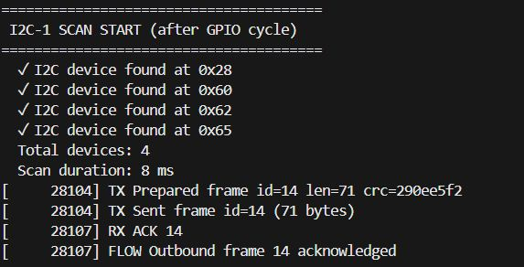

# T-SIM UART Peer Stub (UART1) + GPIO Walk + I2C-1 Incremental Scan

This Arduino/ESP32 sketch is a **UART “peer” stub** intended for **duplex testing** between a T-SIM7080G-S3 (ESP32-S3) and another device over **UART1**.

It implements a tiny, line-oriented framing protocol:

- Receives: `FRAME <id> <len> <crc32>` + **single-line payload** + `END`
- Validates:
  - payload length matches `<len>`
  - CRC32 matches `<crc32>` (computed with `esp_crc32_le`)
- Responds:
  - `ACK <id>` on success
  - `NACK <id>` on failure

In addition, the sketch can:

- Run a **non-blocking “walking 1” GPIO output test** across 8 pins (D0..D7)
- After each full GPIO cycle, start a **watchdog-safe incremental scan** of **I2C bus 1** (`TwoWire(1)`), probing **one address per loop**
- Provide **timestamped USB serial logs** (millis-based)

Serial output:




---

## Features

### 1) UART1 peer stub (receive + validate + ACK/NACK)
- Uses `HardwareSerial(1)` with configurable baud and pins.
- Parses inbound frames from UART1, expecting:

```text
FRAME <id> <len> <crc32hex>
<payload line>
END
````

* Verifies:

  * `<len>` <= `MAX_PAYLOAD_LEN` (default 4096)
  * `payload.length() == <len>`
  * `CRC32(payload) == <crc32>`

* Replies on UART1:

```text
ACK <id>
```

or

```text
NACK <id>
```

### 2) Optional periodic outbound frames (duplex testing)

If enabled, this device will periodically transmit sample frames and wait for `ACK`/`NACK`:

* On `ACK <id>` matching the last sent frame → mark it acknowledged.
* On `NACK <id>` matching the last sent frame → **immediately resend**.
* On timeout (`ACK_TIMEOUT_MS`, default 5000 ms) → **resend**.

### 3) Non-blocking GPIO output “walking 1” test (D0..D7)

* Configures up to 8 GPIOs as outputs.
* Every `GPIO_TEST_INTERVAL_MS` (default 200 ms), sets exactly one pin HIGH and the others LOW.
* After completing a full cycle (wraps from D7 back to D0), it triggers an I2C scan start.

Pins are provided via build flags (`D0_GPIO_CFG`…`D7_GPIO_CFG`). Unset pins default to `-1` and are ignored.

### 4) Watchdog-safe I2C-1 scan (incremental)

* Uses **I2C bus 1**: `TwoWire(1)` (not bus 0).
* Initializes once with explicit SDA/SCL pins.
* After each GPIO full cycle, starts a scan from address `0x03` to `0x77`.
* **Scans one address per loop iteration** to stay watchdog safe.

---

## Hardware / Wiring

### UART1 (BrokerUART)

Defaults (can be overridden with build flags):

* Baud: `921600`
* TX GPIO: `18`  (T-SIM7080G-S3 TX)
* RX GPIO: `8`   (T-SIM7080G-S3 RX)

> Ensure **cross wiring** with the other device:
>
> * This device TX → other device RX
> * This device RX → other device TX
> * Common GND

### I2C bus 1

I2C-1 requires explicit pin configuration via build flags:

* `I2C1_SDA_GPIO_CFG`
* `I2C1_SCL_GPIO_CFG`

Optional:

* `I2C1_FREQ_CFG` (default 400 kHz)

### GPIO walk test

Define up to 8 output pins:

* `D0_GPIO_CFG` … `D7_GPIO_CFG`

Unset pins are skipped.

---

## Protocol details

### Frame header

A header line must start with `FRAME `:

```text
FRAME <id> <len> <crc>
```

* `<id>`: integer frame identifier
* `<len>`: payload length in bytes
* `<crc>`: CRC32 of the payload (hex), computed with `esp_crc32_le()`

### Payload

This stub expects a **single-line payload** (everything up to the next newline). The captured payload is validated against `<len>` and `<crc>`.

### Terminator

The line `END` completes the frame and triggers validation + ACK/NACK.

---

## Configuration (compile-time build flags)

All runtime behavior is controlled by compile-time macros (typically via PlatformIO `build_flags`).

### UART config

* `BROKER_UART_BAUD_CFG` (default 921600)
* `BROKER_UART_TX_GPIO_CFG` (default 18)
* `BROKER_UART_RX_GPIO_CFG` (default 8)

Enable/disable:

* `ENABLE_BROKER_UART_CFG` (default 1)
* `ENABLE_BROKER_PERIODIC_TX_CFG` (default 0)

### Protocol / flow

These are constants in the code:

* `ACK_TIMEOUT_MS` (default 5000)
* `TX_INTERVAL_MS` (default 2000)
* `MAX_PAYLOAD_LEN` (default 4096)

### GPIO walk test

* `ENABLE_GPIO_TEST_CFG` (default 1)
* `GPIO_TEST_INTERVAL_MS_CFG` (default 200)
* `D0_GPIO_CFG` … `D7_GPIO_CFG`

### I2C-1 scan

* `ENABLE_I2C_SCAN_CFG` (default 1)
* `I2C1_SDA_GPIO_CFG` (required to actually init)
* `I2C1_SCL_GPIO_CFG` (required to actually init)
* `I2C1_FREQ_CFG` (default 400000)

---

## Example PlatformIO configuration

```ini
; platformio.ini (example)
[env:tsim7080g]
platform = espressif32
board = esp32-s3-devkitc-1
framework = arduino
monitor_speed = 115200
build_flags =
  -DBROKER_UART_BAUD_CFG=921600
  -DBROKER_UART_TX_GPIO_CFG=18
  -DBROKER_UART_RX_GPIO_CFG=8
  -DENABLE_BROKER_UART_CFG=1
  -DENABLE_BROKER_PERIODIC_TX_CFG=0

  -DENABLE_GPIO_TEST_CFG=1
  -DGPIO_TEST_INTERVAL_MS_CFG=200
  -DD0_GPIO_CFG=9
  -DD1_GPIO_CFG=10
  -DD2_GPIO_CFG=11
  -DD3_GPIO_CFG=12
  -DD4_GPIO_CFG=13
  -DD5_GPIO_CFG=14
  -DD6_GPIO_CFG=21
  -DD7_GPIO_CFG=47

  -DENABLE_I2C_SCAN_CFG=1
  -DI2C1_SDA_GPIO_CFG=7
  -DI2C1_SCL_GPIO_CFG=6
  -DI2C1_FREQ_CFG=400000
```

> Notes:
>
> * Use the correct `board` for your actual PlatformIO environment.
> * If you don’t define I2C1 pins, the sketch will log that I2C-1 is not configured and skip scanning.

---

## What you should see in logs

### Boot

* Build timestamp
* UART1 config
* GPIO test configuration
* I2C-1 init status

### UART receive

* `Header FRAME ...`
* `Payload captured ...`
* `END for frame ...`
* `Frame ... OK` and an `ACK ...` **or** a rejection reason and `NACK ...`

### GPIO + I2C scan

* Every GPIO cycle wrap triggers an I2C scan start.
* Each loop scans one I2C address; discovered devices are printed as:

```text
✓ I2C device found at 0xXX
```

---

## Known limitations / assumptions

* Payload is currently treated as **single-line** (captured from one `readStringUntil('\n')`). Multi-line payloads are not supported in this stub.
* CRC is computed over the payload bytes exactly as received after trimming the line.
* Very high UART baud rates (like 921600) require good wiring/grounding and stable clocks on both ends.

---

## File overview

This program is a single sketch (no separate modules) and includes:

* UART framing + CRC validation
* Duplex ACK/NACK flow for optional periodic TX
* GPIO walking test (non-blocking)
* I2C bus 1 incremental scan (watchdog safe)


