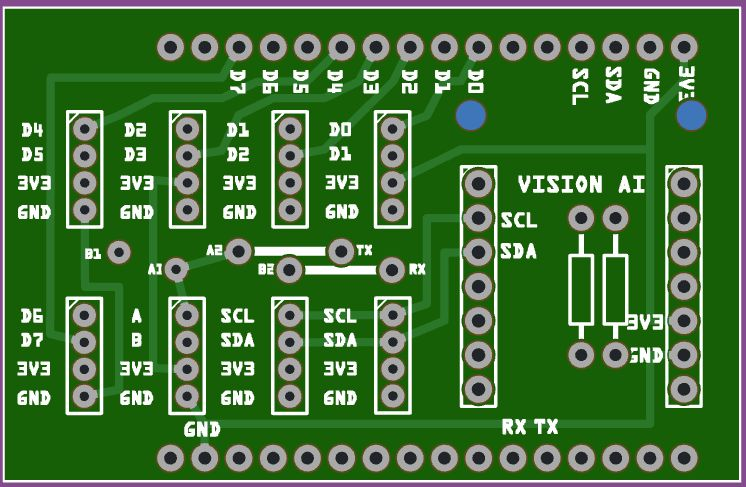

# T-SIM Grove shield (ESP32 / ESP32-S3)

This repository contains a **clean, deterministic UART/I2C/GPIO baseline** used to validate reliable communication between **LilyGO T-SIM boards** and other board using a generic T-SIM Grove Shield. This shield also provides a male header connector for the XIAO slot of the Seeed Grove Vision AI V2 board.

The focus of this development is **transport correctness**, not application logic.
It provides a proven foundation for later integration of camera frames, AI inference data, or other high-volume payloads and the pilot of actuators like relays, DC or stepper motors and other I2C perhiphials development board. 

This development includes a UART stub for testing, build on a XIAO ESP32-S3. This board can be used with the Grove Shield for XIAO, linking both shields with a Grove cable. 

## Printer Circuit Board (PCB)
A Fritzing file (fzz) is available to order the PCB at manufactors at choice.

## TX/RX wiring (Rev. A)
The TX and RX pins of UART Grove connector T-SIM Grove shield can be wired at choice with wire links.
| Config | Wires  | Pin 1 (A) | Pin 2 (B) |
|-----|-----|----|----|
|  1  | A1 -> TX, B1 -> RX | TX | RX |
|  2  | A2 -> RX, B2 -> TX | RX | TX | 

The wiring Pin1-TX, Pin2-RX (first configuration) is complementary to the cable wiring to the Grove Shield for XIAO (as shown in the picture) 

---

## Goals of This Development

This project exists to answer these questions conclusively:

* Are pins wired correctly?
* Is high-speed UART stable (921600 baud) and I2C (400000 Hz)?
* Is the use of output GPIO consistent for all boards?
* Can we use generic shield (e.g. Grove, Relais, Motor driver) for all boards

Example shield:


The image shows earlier version with different UART wiring labels.

---

* All boards use **HardwareSerial(1)** (UART1), leaving UART0 vor Serial communication
* All boards use **I2C-1 **, leaving I2C-0 for internal communication
* USB Serial is used **only for logging**
* The transport implementation is **identical across all boards**

---

## Supported Boards (current & verified)

| Board         | MCU        | Status     |
| ------------- | ---------- | ---------- |
| XIAO ESP32-S3 | ESP32-S3   | ✅ Verified |
| T-SIM7080G-S3 | ESP32-S3   | ✅ Verified |
| T-SIM7070     | ESP32      | ✅ Verified |
| T-SIM7000G    | ESP32      | ✅ Verified |
| T-SIM7600     | ESP32 / S3 | 🔜 Planned |
| T-SIM7670G     | ESP32 / S3 | 🔜 Planned |

All verified boards are running **the same transport codebase**, differentiated only by PlatformIO environment configuration (pins, USB mode).

---

## Pin Configuration

### T-SIM7080G-S3 (ESP32-S3)

| Signal | GPIO   | Notes |
| ------ | ------ | ----- |
| 3v3 | ------ | (P1.1) |
| GND | ------ | (P1.2) |
| SDA | GPIO16 | I2C-1 (P1.3) |
| SCL | GPIO17 | I2C-1 (P1.4) |
| TX  | GPIO43 | UART1 TX (P2.5)  |
| RX  | GPIO44 | UART1 RX (P2.6)  |
| D0 | GPIO03 | ----- |
| D1 | GPIO46 | *to be confirmed* |
| D2 | GPIO09 | ----- |
| D3 | GPIO10 | ----- |
| D4 | GPIO11 | ----- |
| D5 | GPIO12 | ----- |
| D6 | GPIO13 | ----- |
| D7 | GPIO14 | ----- |


### / T-SIM7000G / T-SIM7070 / T-SIM7600 / T-SIM7670G (ESP32 classic)

| Signal | GPIO   | Notes           |
| ------ | ------ | --------------- |
| 3v3 | ------ | (P1.1) |
| GND | ------ | (P1.2) |
| SDA | GPIO32 | I2C-1 (P1.3) |
| SCL | GPIO33 | I2C-1 (P1.4) |
| TX  | GPIO22 | UART1 TX (P2.5) |
| RX  | GPIO21 | UART1 RX (P2.6) |
| D0 | GPIO26 | ----- |
| D1 | GPIO25 | ----- |
| D2 | GPIO27 | ----- |
| D3 | GPIO04 | ----- |
| D4 | GPIO02 | ----- |
| D5 | GPIO15 | ----- |
| D6 | GPIO14 | ----- |
| D7 | GPIO13 | ----- |


**Important:**

* TX ↔ RX must be crossed
* GND must be shared
* Baud: 921600, 8N1 

---

## Architecture Overview for UART stub

```
+-------------------+        UART1 (921600 baud)        +---------------------+
| XIAO ESP32-S3     |  <----------------------------> | T-SIM (7080 / 7070 / |
| (Sender / Master) |                                  | 7000 Peer)          |
+-------------------+                                  +---------------------+
        |                                                             |
        | USB Serial (logs)                                           | USB Serial (logs)
        v                                                             v
   PlatformIO Monitor                                           PlatformIO Monitor
```

---

## Transport Protocol

The transport uses a **simple, explicit frame protocol**.

### Frame Format (wire-level)

```
FRAME <id> <len> <crc>
<payload>
END
```

### Fields

| Field     | Meaning                       |
| --------- | ----------------------------- |
| `id`      | Monotonic frame ID (uint32)   |
| `len`     | Exact payload length in bytes |
| `crc`     | CRC32 (little-endian, hex)    |
| `payload` | Message body                  |

The CRC is calculated **only over the payload**.

---

## Payload

In this baseline, the payload is **JSON text**, chosen for visibility:

```json
{
  "type": "sample",
  "frame": 7,
  "ts_ms": 16596,
  "msg": "Hello from XIAO UART1"
}
```

The transport is **payload-agnostic**. Binary data can replace JSON later without changing the protocol.

---

## CRC Handling

* Algorithm: **CRC32 little-endian**
* Implementation: `esp_crc32_le()` (ESP32 ROM)

A frame is rejected if:

* Payload length mismatches `len`
* Payload length exceeds safety limit
* CRC does not match

Rejected frames trigger a **NACK**.

---

## ACK / NACK Flow Control

### Normal flow

1. Sender transmits frame `N`
2. Receiver validates payload
3. Receiver replies:

```
ACK N
```

4. Sender advances to frame `N+1`

### Error flow

If validation fails:

```
NACK N
```

Sender resends **the same cached frame**.

### Timeout recovery

If no ACK or NACK is received within **5 seconds**:

* Sender automatically resends
* Frame ID does **not** advance

This guarantees reliable delivery over UART.

---

## Logging

Both sides produce **timestamped logs** on USB Serial:

```
[      9337] RX Frame id=5 OK: len=70 crc=2b685ad5
[      9337] TX ACK 5
```

Logging includes:

* RX header detection
* Payload capture
* CRC validation result
* ACK / NACK transmission
* Retry and timeout events

This makes transport behavior fully observable.

---

## PlatformIO Usage

### Upload (fixed COM port)

```ini
upload_port  = COM3
monitor_port = COM3
monitor_speed = 115200
```

### Build & upload

```bash
pio run -e t-sim7080g-s3 -t upload
```

### Monitor

```bash
pio device monitor
```

---

## What This Code Is (and Is Not)

### ✅ This is

* A transport validation harness
* A reliable UART framing baseline
* A reference implementation
* Safe to extend

### ❌ This is not

* A final production protocol
* Optimized for throughput
* Streaming-based
* Tied to AI, camera, or Grove logic

---

## Status

✅ **Transport proven stable across multiple devices**

This repository represents a known-good, cross-board UART communication foundation for:

* T-SIM7080G S3
* T-SIM7000G
* T-SIM7070G
* T-SIM7600
* T-SIM7670G S3

### UART stub for testing
* XIAO ESP32-S3

All devices have been validated at **921600 baud**, with correct CRC handling, ACK/NACK flow control, and automatic resend behavior.
